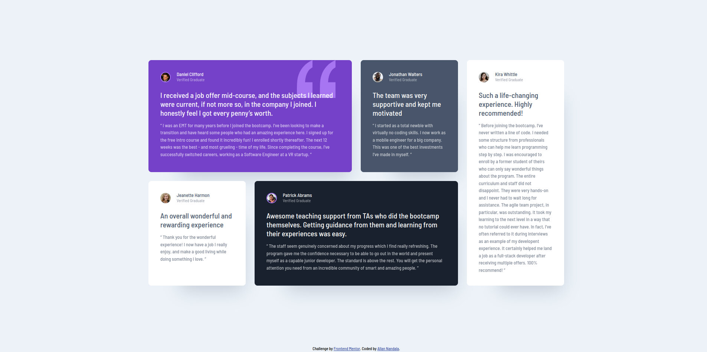

# Frontend Mentor - Testimonials grid section solution

This is a solution to the [Testimonials grid section challenge on Frontend Mentor](https://www.frontendmentor.io/challenges/testimonials-grid-section-Nnw6J7Un7). Frontend Mentor challenges help you improve your coding skills by building realistic projects.

## Table of contents

- [Overview](#overview)
  - [The challenge](#the-challenge)
  - [Screenshot](#screenshot)
  - [Links](#links)
  - [Built with](#built-with)
  - [What I learned](#what-i-learned)
  - [Useful resources](#useful-resources)
- [Author](#author)

## Overview

### The challenge

Users should be able to:

- View the optimal layout for the site depending on their device's screen size

### Screenshot



### Links

- Solution URL: [https://github.com/nandala-allan/testimonials-grid-section/tree/main]()
- Live Site URL: [https://gleaming-valkyrie-1d5cff.netlify.app/]()

### Built with

- Semantic HTML5 markup
- CSS custom properties
- Flexbox
- CSS Grid
- Mobile-first workflow

### What I learned

I learned how to declare grid template areas using names so they can easly be used when writing the css in responsive design

To see how you can add code snippets, see below:

```css
.proud-of-this-css {
  grid-template-areas:
    "one"
    "two"
    "three"
    "four"
    "five";
}

@media screen and (min-width: 33em) {
  .testimonial-grid {
    grid-template-areas:
      "one one"
      "two three"
      "five five"
      "four four";
  }
}
```

### Useful resources

- [Wes Bos: CSS Grid](https://cssgrid.io/) - This helped me to understand css grid fundamentals and its usage.

## Author

- Frontend Mentor - [@Allanlcomander](https://www.frontendmentor.io/profile/Allanlcomander)
